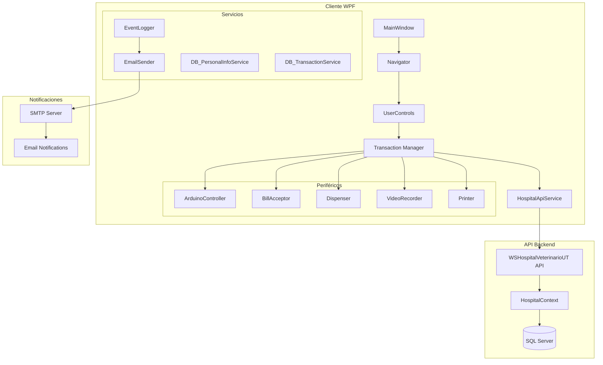
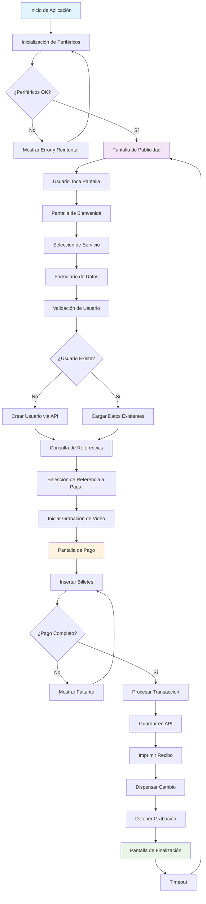
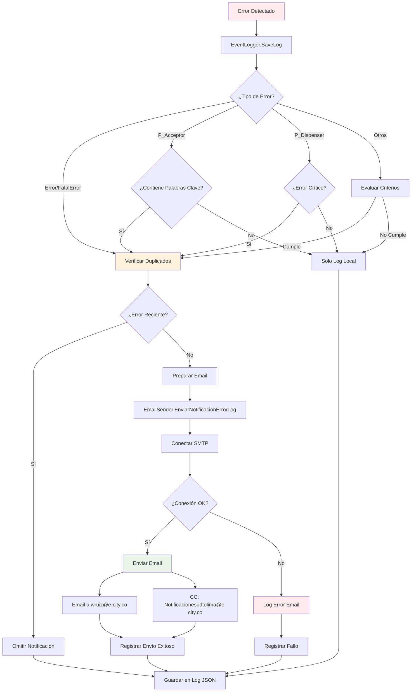
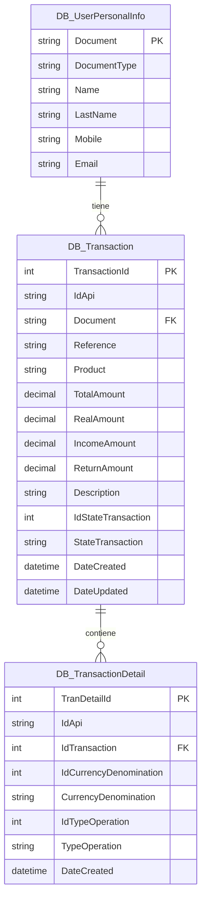
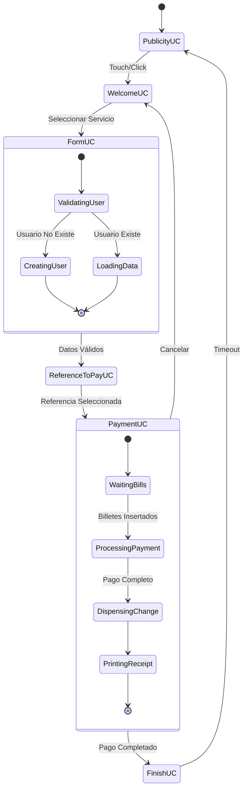

# Hospital Veterinario UT - Sistema de Pagos y Recaudos

## Introducción

El **Hospital Veterinario UT** es una aplicación WPF desarrollada en C# que funciona como un sistema de kiosco para pagos y recaudos universitarios. La aplicación integra múltiples periféricos (aceptador de billetes, dispensador, Arduino, impresora) y utiliza una arquitectura basada en API REST para la gestión de datos.

## Arquitectura del Sistema



## Flujo Principal de la Aplicación



## Flujo de Manejo de Errores y Notificaciones



## Arquitectura de Datos



## Componentes Principales

### 1. **MainWindow.xaml.cs**
- Punto de entrada de la aplicación
- Inicialización de periféricos (Arduino, Aceptador, Dispensador)
- Configuración del Navigator para navegación entre pantallas
- Manejo de combinaciones de teclas para pruebas (Ctrl+Alt+L)

### 2. **Transaction.cs (Singleton)**
- Gestiona el estado global de la transacción
- Contiene información del proceso de pago y usuario
- Integra VideoRecorder para grabación de sesiones
- Maneja la comunicación con servicios externos

### 3. **HospitalApiService.cs**
- Cliente HTTP para comunicación con la API REST
- Métodos para CRUD de usuarios y transacciones
- Manejo de DTOs para transferencia de datos
- Configuración SSL y timeouts

### 4. **EventLogger.cs**
- Sistema de logging centralizado con categorización
- Detección inteligente de errores críticos
- Integración con sistema de notificaciones por email
- Prevención de spam de notificaciones duplicadas

### 5. **EmailSender.cs**
- Envío de notificaciones automáticas por SMTP
- Configuración empresarial (mail.1cero1.com:465)
- Formato de mensajes para usuarios y desarrolladores
- Logs detallados de actividad de email

## Configuración del Sistema

### App.config - Configuraciones Principales

```xml
<appSettings>
    <!-- API Configuration -->
    <add key="HospitalApiBaseUrl" value="https://localhost:7287/api/Hospital/" />
    
    <!-- Email Configuration -->
    <add key="EmailSmtpServer" value="mail.1cero1.com" />
    <add key="EmailSmtpPort" value="465" />
    <add key="EmailUsername" value="wruiz@e-city.co" />
    <add key="EmailPassword" value="Abcde1234*" />
    <add key="EmailSenderName" value="Hospital Veterinario UT" />
    <add key="EmailAdminAddress" value="wruiz@e-city.co" />
    <add key="EmailCcAddress" value="Notificacionesudtolima@e-city.co" />
    <add key="EmailEnableNotifications" value="true" />
    
    <!-- Peripheral Configuration -->
    <add key="arduinoPort" value="COM3" />
    <add key="dispenserDenominations" value="1000,2000,5000,10000,20000,50000" />
</appSettings>
```

## API Endpoints

### Base URL: `https://localhost:7287/api/Hospital/`

| Método | Endpoint | Descripción |
|--------|----------|-------------|
| GET | `/User/{document}` | Obtener usuario por documento |
| POST | `/User` | Crear o actualizar usuario |
| GET | `/User/Search?query={query}` | Buscar usuarios |
| GET | `/Transaction/{id}` | Obtener transacción por ID |
| POST | `/Transaction` | Crear nueva transacción |
| PUT | `/Transaction/{id}` | Actualizar transacción |
| GET | `/Transactions/{document}` | Obtener transacciones por documento |
| POST | `/TransactionDetail` | Crear detalle de transacción |
| GET | `/Test` | Verificar conectividad |

## Flujo de Navegación entre Pantallas



## Integración de Periféricos

### Arduino Controller
- **Puerto**: Configurable via App.config (COM3 por defecto)
- **Función**: Control de sensores y actuadores
- **Reintentos**: Automático con mensajes informativos

### Aceptador de Billetes
- **Denominaciones Aceptadas**: 2000, 5000, 10000, 20000, 50000, 100000 COP
- **NOTA**: No acepta billetes de 1000 (ya no existen en circulacion)
- **NOTA**: No acepta monedas
- **Validación**: Tiempo real con feedback visual
- **Errores**: Notificación automática por email

### Dispensador de Cambio
- **Billetes**: 2000 y 10000 COP (2 baúles)
- **Monedas**: 500 y 100 COP
- **Control**: Independiente del Arduino (configurable)
- **Verificación**: Sensores de carga antes de operación
- **Mantenimiento**: Alertas automáticas de estado

### Video Recorder
- **Inicio**: Al ingresar datos del formulario
- **Duración**: Durante todo el proceso de pago
- **Formato**: Archivos con timestamp
- **Almacenamiento**: Local con limpieza automática

## Sistema de Logs

### Estructura de Directorios
```
Logs/
├── Log_application/     # Logs generales de la aplicación
├── Log_peripherals/     # Logs de dispositivos periféricos
├── Log_integration/     # Logs de integraciones externas
└── email_log_YYYYMMDD.txt  # Logs específicos de email
```

### Tipos de Eventos
- **FatalError**: Errores críticos que requieren intervención inmediata
- **Error**: Errores que afectan funcionalidad pero permiten continuar
- **Warning**: Advertencias que no afectan operación
- **Info**: Información general de operación
- **P_Acceptor**: Eventos específicos del aceptador de billetes
- **P_Arduino**: Eventos del controlador Arduino
- **P_Dispenser**: Eventos del dispensador de cambio

## Instalación y Configuración

### Prerrequisitos
1. **.NET Framework 4.8** o superior
2. **SQL Server** (192.168.20.24) con base de datos UNIVERSIDAD_TOLIMA
3. **API Backend** ejecutándose en puerto 7287
4. **Periféricos** conectados y configurados

### Pasos de Instalación

1. **Clonar el repositorio**
```bash
git clone [repository-url]
cd WPFUTHospitalVeterinario
```

2. **Configurar App.config**
   - Actualizar URLs de API
   - Configurar credenciales de email
   - Ajustar puertos de periféricos

3. **Restaurar paquetes NuGet**
```bash
dotnet restore
```

4. **Compilar la solución**
```bash
dotnet build --configuration Release
```

5. **Ejecutar la aplicación**
```bash
dotnet run --project WPFHospitalVeterinarioUT
```

## Configuración de Periféricos

### Arduino
1. Conectar Arduino al puerto USB
2. Verificar puerto COM en Administrador de Dispositivos
3. Actualizar `arduinoPort` en App.config
4. Cargar firmware específico del proyecto

### Aceptador de Billetes
1. Conectar via puerto serie o USB
2. Configurar denominaciones aceptadas
3. Calibrar sensores según manual del fabricante
4. Probar con billetes de prueba

### Dispensador
1. Cargar billetes en casetes correspondientes
2. Verificar sensores de nivel
3. Ejecutar rutina de calibración
4. Probar dispensado manual

## Monitoreo y Mantenimiento

### Logs de Sistema
- **Ubicación**: `./Logs/`
- **Rotación**: Diaria automática
- **Retención**: 30 días (configurable)
- **Formato**: JSON estructurado

### Notificaciones por Email
- **Destinatarios**: wruiz@e-city.co, Notificacionesudtolima@e-city.co
- **Frecuencia**: Máximo 1 por error cada 5 minutos
- **Contenido**: Mensaje para usuario + detalles técnicos

### Mantenimiento Preventivo
1. **Diario**: Verificar logs de errores
2. **Semanal**: Limpiar periféricos y verificar conexiones
3. **Mensual**: Actualizar denominaciones y verificar calibración
4. **Trimestral**: Backup de configuraciones y actualización de software

## Solución de Problemas Comunes

### Error de Conexión a API
```
Síntoma: "No se pudo establecer conexión con la API"
Solución: 
1. Verificar que la API esté ejecutándose
2. Comprobar URL en App.config
3. Verificar conectividad de red
4. Revisar certificados SSL
```

### Periféricos No Detectados
```
Síntoma: "Periféricos no conectados correctamente"
Solución:
1. Verificar conexiones físicas
2. Comprobar puertos COM en App.config
3. Reiniciar dispositivos
4. Verificar drivers instalados
```

### Errores de Email
```
Síntoma: "Error al enviar notificación por correo"
Solución:
1. Verificar credenciales SMTP
2. Comprobar configuración de firewall
3. Validar servidor SMTP disponible
4. Revisar logs de email detallados
```

## Desarrollo y Extensión

### Estructura del Proyecto
```
WPFHospitalVeterinarioUT/
├── Domain/                 # Lógica de negocio
│   ├── ApiService/        # Modelos de API
│   ├── Enumerables/       # Enumeraciones
│   ├── Peripherals/       # Control de periféricos
│   └── UIServices/        # Servicios de UI
├── Presentation/          # Interfaz de usuario
│   ├── UserControls/      # Controles personalizados
│   └── Shared/           # Componentes compartidos
├── Assets/               # Recursos multimedia
└── Properties/           # Configuraciones del proyecto
```

### Patrones de Diseño Utilizados
- **Singleton**: Transaction, Navigator
- **Observer**: PropertyChanged en modelos
- **Factory**: Creación de UserControls
- **Repository**: Servicios de datos

### Extensiones Recomendadas
1. **Nuevos Métodos de Pago**: Tarjetas, QR, NFC
2. **Reportes Avanzados**: Dashboard en tiempo real
3. **Integración Móvil**: App complementaria
4. **IA/ML**: Detección de fraudes, optimización de cambio

## Contacto y Soporte

**Desarrollador**: William Ruiz  
**Email**: wruiz@e-city.co  
**Organización**: E-City  
**Proyecto**: Hospital Veterinario UT - Universidad del Tolima

---

*Documentación generada automáticamente - Última actualización: 2025-09-03*

---

## 🔒 Correcciones de Seguridad - Rama VULNERABILITY

### Resumen de Vulnerabilidades Encontradas y Corregidas

**Fecha de Análisis**: 20 de abril, 2026  
**Rama**: VULNERABILITY (creada desde PRODUCCION)  
**Total Vulnerabilidades**: 18 (4 Críticas, 6 Altas, 5 Medias, 3 Bajas)

---

### ✅ VULNERABILIDADES CRÍTICAS CORREGIDAS

#### 1. Validación de Entrada en Dispensador
**Archivo**: `Domain/Peripherals/Dispenser/Dispenser.cs`  
**Problema**: No se validaban valores negativos ni cero en `DispenseAmount()`  
**Impacto**: Comportamiento indefinido, posibles cálculos erróneos  
**Solución**: 
```csharp
// Línea 115-133
if (dispendAmount <= 0)
{
    EventLogger.SaveLog(EventType.Error, $"Intento de dispensacion con valor invalido: {dispendAmount}");
    throw new ArgumentException("El valor a dispensar debe ser mayor a cero");
}
```

#### 2. Verificación de MustReinitialize
**Archivo**: `Domain/Peripherals/Dispenser/Dispenser.cs`  
**Problema**: No se verificaba el estado del dispensador antes de operar  
**Impacto**: Intentar dispensar con hardware en estado de error  
**Solución**:
```csharp
// Línea 125-130
if (MustReinitialize)
{
    EventLogger.SaveLog(EventType.Error, "Dispensador requiere reinicializacion antes de operar");
    throw new InvalidOperationException("El dispensador requiere reinicializacion tras un error critico");
}
```

#### 3. Limpieza de Variables en Cada Dispensación
**Archivo**: `Domain/Peripherals/Dispenser/Dispenser.cs`  
**Problema**: `CleanVariable()` solo se llamaba en `Start()`, no en cada dispensación  
**Impacto**: Estado residual de transacciones anteriores afectaba nuevas operaciones  
**Solución**:
```csharp
// Línea 132-133 - Se llama CleanVariable() al inicio de DispenseAmount()
CleanVariable();
```

#### 4. Límite de Recursión en GoDispend
**Archivo**: `Domain/Peripherals/Dispenser/Dispenser.cs`  
**Problema**: Función recursiva sin límite de profundidad  
**Impacto**: StackOverflowException si múltiples baúles están vacíos  
**Solución**:
```csharp
// Línea 176, 179-186
private static string GoDispend(int dispendValue, List<int>? cassetteToIgnore = null, int depth = 0)
{
    // Limite de recursión
    if (depth > 4)
    {
        EventLogger.SaveLog(EventType.Error, $"Limite de recursion alcanzado (depth={depth}). Dispensacion abortada.");
        CoinsValue = _valueToDispense - DispensedValue;
        MustReinitialize = true;
        return DISP_MAXREJECT;
    }
    // ...
}
```

#### 5. Null-Conditional en Eventos del Aceptador
**Archivo**: `Domain/Peripherals/Acceptor/MeiAcceptor.cs`  
**Problema**: Eventos se invocaban sin verificar suscriptores (`BillAccepted.Invoke()`)  
**Impacto**: NullReferenceException y crash de la aplicación  
**Solución**:
```csharp
// Línea 342, 347, 376, 406, 425, 442, 458 - Cambiar .Invoke() a ?.Invoke()
BillAccepted?.Invoke(Convert.ToDecimal(acep.Bill.Value));
AcceptorError?.Invoke(ex);
```

---

### ✅ VULNERABILIDADES ALTAS CORREGIDAS

#### 6. Bug en Loop TryEject
**Archivo**: `Domain/Peripherals/Dispenser/Dispenser.cs`  
**Problema**: Loop ejecutaba 4 veces en lugar de 3 (`tries >= 0`)  
**Solución**: Cambiado a `tries > 0` (Línea 392)

#### 7. Validación de Denominaciones de Billetes
**Archivo**: `Domain/Peripherals/Acceptor/MeiAcceptor.cs`  
**Problema**: No se validaba que el billete tuviera una denominación permitida  
**Impacto**: Aceptación de billetes con valores inesperados  
**Solución**:
```csharp
// Línea 337-352
int[] allowedDenominations = { 1000, 2000, 5000, 10000, 20000, 50000 };
bool isValidDenomination = false;
foreach (var denom in allowedDenominations)
{
    if (acep.Bill.Value == denom)
    {
        isValidDenomination = true;
        break;
    }
}

if (!isValidDenomination)
{
    EventLogger.SaveLog(EventType.Error, $"Aceptador: Billete de denominacion invalida o desconocida: {acep.Bill.Value}");
    return;
}
```

#### 8. Implementación de MeiBillEscrow
**Archivo**: `Domain/Peripherals/Acceptor/MeiAcceptor.cs`  
**Problema**: Evento vacío sin implementación  
**Impacto**: Sin logging de billetes en escrow (importante para auditoría)  
**Solución**: Implementado logging con try-catch (Línea 369-383)

---

### 📊 Resultados de Pruebas Automatizadas

Script de pruebas: `Tests/Run-SecurityTests.ps1`

```
========================================
SECURITY TESTS - PERIPHERALS
========================================

--- DISPENSER TESTS ---
[CRITICAL] Negative value validation - PASSED
[HIGH] Zero value validation - PASSED
[CRITICAL] Max value overflow check - PASSED
[CRITICAL] Static variables race condition - PASSED
[CRITICAL] Unlimited recursion risk - PASSED
[HIGH] CleanVariable not called each time - PASSED
[HIGH] MustReinitialize not blocking - PASSED
[HIGH] CoinsValue can be negative - PASSED
[HIGH] TryEject runs 4 times not 3 - PASSED
[MEDIUM] Denominations not validated - PASSED

--- ACCEPTOR TESTS ---
[CRITICAL] Events without null check - PASSED
[CRITICAL] AcceptorError no null check - PASSED
[HIGH] No bill validation - PASSED
[HIGH] Handlers without try-catch - PASSED
[MEDIUM] No connection heartbeat - PASSED
[HIGH] StackerFull not blocking - PASSED
[MEDIUM] No state persistence - PASSED
[LOW] MeiBillEscrow empty - PASSED

========================================
RESULTS SUMMARY
========================================
Total tests:    18
Passed:         18
Failed:         0
Success rate:     100%
```

---

### 📁 Archivos de Documentación de Seguridad

1. **Tests/VULNERABILITY_REPORT.md** - Reporte detallado con todas las vulnerabilidades y soluciones
2. **Tests/Run-SecurityTests.ps1** - Script de pruebas automatizadas
3. **Tests/DispenserSecurityTests.cs** - Pruebas unitarias del dispensador
4. **Tests/AcceptorSecurityTests.cs** - Pruebas unitarias del aceptador

---

### 🧪 Pruebas Recomendadas Antes de Merge a PRODUCCION

#### Pruebas de Dispensador:
- [ ] Intentar dispensar valor negativo → Debe lanzar excepción
- [ ] Intentar dispensar cero → Debe lanzar excepción
- [ ] Verificar que CleanVariable se llama cada vez
- [ ] Probar dispensación con baúl vacío → Debe detenerse después de 4 reintentos
- [ ] Verificar que MustReinitialize bloquea operaciones
- [ ] Verificar que CoinsValue nunca es negativo

#### Pruebas de Aceptador:
- [ ] Insertar billete normal → Debe aceptar y loguear
- [ ] Verificar que no crashea si no hay suscriptores a eventos
- [ ] Insertar billete con valor raro → Debe rechazar y loguear error
- [ ] Verificar logging en escrow
- [ ] Verificar que se validan denominaciones

#### Pruebas de Estrés:
- [ ] Múltiples dispensaciones consecutivas
- [ ] Inserción rápida de billetes
- [ ] Verificar concurrencia (si aplica)

---

### 📝 Notas Importantes

1. **ESTADO ACTUAL**: Cambios sin commit en rama VULNERABILITY, listos para pruebas
2. **PRÓXIMO PASO**: Ejecutar pruebas con hardware real antes de hacer merge
3. **BACKUP**: Rama PRODUCCION permanece intacta
4. **DOCUMENTACIÓN**: Ver `VULNERABILITY_REPORT.md` para detalles completos de cada vulnerabilidad

---

### 🚀 Procedimiento para Merge (Después de Pruebas Exitosas)

```bash
# 1. Verificar que las pruebas pasaron
cd Tests
.\Run-SecurityTests.ps1

# 2. Hacer commit de los cambios
git add -A
git commit -m "CORRECCION CRITICA: Reparacion de vulnerabilidades de seguridad"

# 3. Push a repositorio remoto
git push origin VULNERABILITY

# 4. Crear Pull Request para merge a PRODUCCION
git checkout PRODUCCION
git merge VULNERABILITY

# 5. Eliminar rama temporal (opcional)
git branch -d VULNERABILITY
```

---

**Revisado por**: Análisis Automatizado de Seguridad  
**Estado**: ⚠️ PENDIENTE DE PRUEBAS CON HARDWARE REAL  
**Prioridad**: 🔴 ALTA - Corregir antes de próximo despliegue a producción
