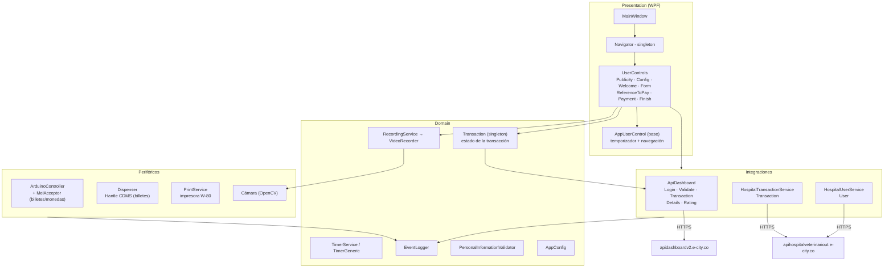
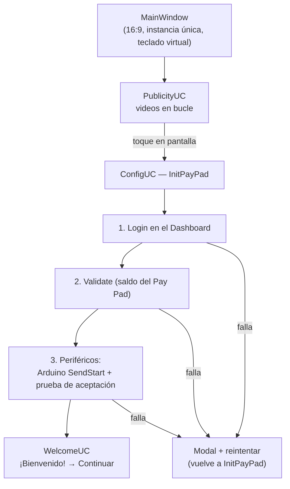
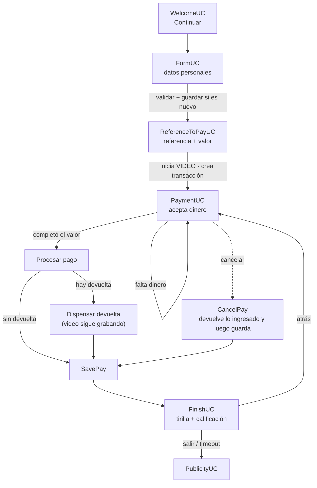
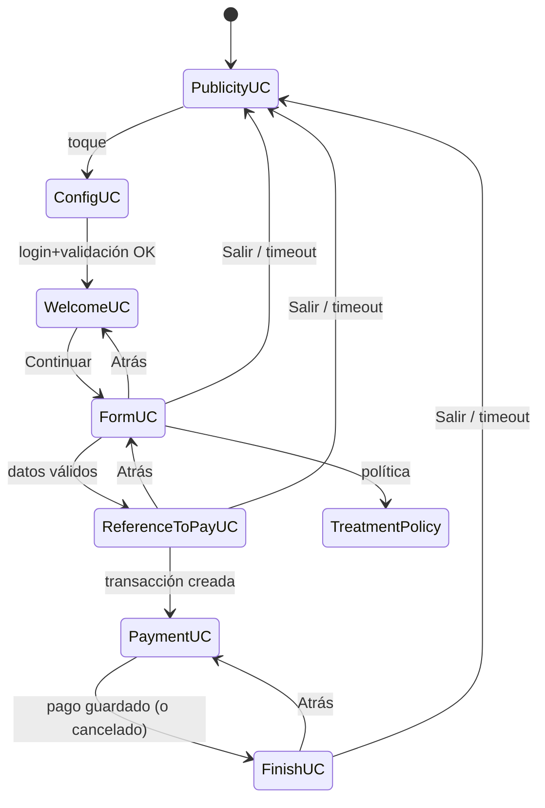

# Hospital Veterinario UT — Sistema de pagos y recaudos (Pay+)

Aplicación de **kiosco** en WPF (.NET 6) para el pago de facturas y recaudos del Hospital Veterinario de la Universidad del Tolima. El usuario ingresa su documento, sus datos personales y el valor a pagar; la máquina **recibe dinero en efectivo, entrega la devuelta e imprime la tirilla**, y todo el proceso queda registrado en dos sistemas por API y **grabado en video**.

---

## Tabla de contenido

1. [Qué hace la aplicación](#1-qué-hace-la-aplicación)
2. [Requisitos y compilación](#2-requisitos-y-compilación)
3. [Arquitectura y estructura del proyecto](#3-arquitectura-y-estructura-del-proyecto)
4. [Flujos](#4-flujos)
   - 4.1 [Arranque y habilitación del kiosco](#41-arranque-y-habilitación-del-kiosco)
   - 4.2 [Flujo completo de una transacción](#42-flujo-completo-de-una-transacción)
   - 4.3 [Formulario: validaciones, consulta y guardado del usuario](#43-formulario-validaciones-consulta-y-guardado-del-usuario)
   - 4.4 [Referencia y valor a pagar](#44-referencia-y-valor-a-pagar)
   - 4.5 [Pago en efectivo: aceptación, devuelta y cancelación](#45-pago-en-efectivo-aceptación-devuelta-y-cancelación)
   - 4.6 [Cierre: impresión, calificación y fin](#46-cierre-impresión-calificación-y-fin)
   - 4.7 [Temporizadores](#47-temporizadores)
   - 4.8 [Grabación de video](#48-grabación-de-video)
5. [Pantallas y navegación](#5-pantallas-y-navegación)
6. [Integraciones (API)](#6-integraciones-api)
7. [Periféricos](#7-periféricos)
8. [Estados y tipos de transacción](#8-estados-y-tipos-de-transacción)
9. [Logs](#9-logs)
10. [Configuración (App.config)](#10-configuración-appconfig)
11. [Pruebas recomendadas](#11-pruebas-recomendadas)
12. [Notas de diseño y mantenimiento](#12-notas-de-diseño-y-mantenimiento)
13. [Documentos relacionados](#13-documentos-relacionados)

---

## 1. Qué hace la aplicación

- **Cobra en efectivo**: acepta billetes, acumula el valor, calcula el redondeo a la centena y **devuelve la diferencia** (billetes por el dispensador CDMS y monedas por el Arduino).
- **Registra al usuario**: si el documento no existe en la base de la universidad, pide los datos personales y los guarda por API; si ya existe, **autocompleta el formulario**.
- **Registra la transacción en dos lugares**:
  - **API Dashboard (E-City)**: panel administrativo del hospital. Ahí viven la transacción, sus detalles (aceptación, dispensado, rechazos) y la calificación.
  - **API UT (Universidad del Tolima)**: base de datos de la universidad. Ahí queda el **usuario** (documento y datos personales) y la **transacción** sincronizada.
- **Imprime la tirilla** (impresora W-80; en modo de desarrollo genera un PDF con las mismas medidas).
- **Graba video de todo el proceso de pago** como evidencia del dinero recibido y devuelto.
- **No utiliza base de datos local**: toda la persistencia es por API (véase `REVISION_TECNICA.md`).

---

## 2. Requisitos y compilación

| Requisito | Detalle |
|---|---|
| Sistema | Windows 10/11 |
| IDE | Visual Studio 2022 |
| SDK | .NET 6 (`net6.0-windows`, WPF) |
| Arquitectura | **x86 obligatorio** (`PlatformTarget = x86`): las DLLs de periféricos (`CDMS_CDU.dll`, `Msprintsdk.dll`, `MPOST.dll`) son de 32 bits |
| DLLs nativas | `resources/MPOST6/MPOST.dll` (referenciada por el proyecto) y las SDK del dispensador/impresora |

Dependencias NuGet: `MahApps.Metro`, `MaterialDesignThemes`, `Microsoft.Web.WebView2`, `Newtonsoft.Json`, `System.IO.Ports`, `OpenCvSharp4` (+ runtime Windows), `System.Drawing.Common`.

### Compilación

```powershell
dotnet restore .\src\WPFHospitalVeterinarioUT.sln
dotnet build .\src\WPFHospitalVeterinarioUT.sln -c Debug   -p:Platform=x86
dotnet build .\src\WPFHospitalVeterinarioUT.sln -c Release -p:Platform=x86
```

### Las dos configuraciones

| Configuración | Constante | Periféricos | Para qué sirve |
|---|---|---|---|
| `Debug` | `NO_PERIPHERALS` definida | **No se inicializan** | Desarrollo y pruebas en un PC sin hardware. En la pantalla de pago aparecen dos botones de prueba: *Add minor value* ($20.000) y *Add mid value* ($50.000). La tirilla se genera como PDF. |
| `Release` | Sin constante | **Reales** | Producción: Arduino, aceptador, dispensador, impresora. Sin botones de prueba. |

> `DISPENSER_CONTROLLED_BY_ARDUINO` se deja **intencionalmente sin definir**: en la arquitectura híbrida, los **billetes** los controla el CDMS por `dispenserPort` y el **Arduino/CH340 controla únicamente la devolución en monedas**.

Las salidas quedan en `src/WPFHospitalVeterinarioUT/bin/<Configuración>/net6.0-windows/` (junto con las carpetas `Logs/`, `Videos/` y `Receipts/`).

---

## 3. Arquitectura y estructura del proyecto



### Estructura de carpetas (solo lo relevante)

```
WPFUTHospitalVeterinario/
├── README.md                        ← este documento
├── IMPRESION_TIRILLA.md             ← detalle de la impresión (W-80 y PDF)
├── ESPECIFICACION_VALIDACIONES_FORMULARIO.md
├── REVISION_TECNICA.md              ← revisión técnica del proyecto (colas, logs, conectividad)
├── resources/FLUJO_UNIVERDIDAD_DEL_TOLIMA_v2.pdf
└── src/WPFHospitalVeterinarioUT/
    ├── App.xaml.cs                  ← instancia única, teclado virtual, error fatal
    ├── MainWindow.xaml.cs           ← tamaño de kiosco; inicializa periféricos (solo Release)
    ├── App.config                   ← TODA la configuración (puertos, APIs, credenciales)
    ├── Domain/
    │   ├── ApiService/
    │   │   ├── ApiDashboard.cs               ← API del Dashboard E-City (transacciones)
    │   │   ├── HospitalUserService.cs        ← API UT: usuarios (GET/POST User)
    │   │   ├── HospitalTransactionService.cs ← API UT: transacciones (POST/PUT)
    │   │   ├── Models/                       ← DTOs y respuestas
    │   │   └── QueueModels/RequestQueue.cs   ← cola de escrituras (un consumidor, reintentos)
    │   ├── Peripherals/
    │   │   ├── ArduinoController.cs          ← Arduino/CH340: aceptación y monedas (+ MEI dentro)
    │   │   ├── Acceptor/MeiAcceptor.cs       ← aceptador de billetes MEI
    │   │   ├── Dispenser/{Dispenser,CDMS_Handler,CDMS_Api}.cs ← Hantle CDMS (billetes)
    │   │   ├── Printer/PrintService.cs       ← tirilla W-80 / PDF
    │   │   ├── Recorder/{RecordingService,VideoRecorder}.cs   ← video
    │   │   └── Scanner/ScannerController.cs  ← sin uso en el flujo
    │   ├── Validation/PersonalInformationValidator.cs
    │   ├── UIServices/
    │   │   ├── Navigator.cs · Transaction.cs
    │   │   ├── TimerService.cs · TimerGeneric.cs
    │   │   └── ImageSlider.cs                ← sin uso en el flujo
    │   ├── Enumerables/            ← StateTransaction, TypePayment, TypeTransaction, TypeOperation
    │   ├── EventLogger.cs          ← logs en 3 carpetas
    │   └── AppConfig.cs · Variables/Messages.cs
    └── Presentation/UserControls/
        ├── Bases/  ← AppUserControl (base), ConfigUC, WelcomeUC, FinishUC, TreatmentPolicy
        └── Flows/  ← FormUC, ReferenceToPayUC, PaymentUC (+ PaymentViewModel), PublicityUC
```

---

## 4. Flujos

### 4.1 Arranque y habilitación del kiosco



- **Instancia única**: al iniciar, `App.xaml.cs` mata cualquier otra instancia de la aplicación.
- **Periféricos al abrir (solo Release)**: antes de navegar, `MainWindow` llama a `ArduinoController.Initialize(arduinoPort, dispenserDenominations)` y verifica la carga del dispensador con `Dispenser.GetLoadMessage()`. Si algo falla, muestra un modal con el número de intento y reintenta hasta que quede listo.
- **`ConfigUC`** repite el ciclo completo de validación ante cualquier fallo (modal informativo y reintento). La validación de impresora (`PrintService.CheckPrintStatus()`) está **comentada**: hoy no bloquea el arranque.
- En **Debug** (`NO_PERIPHERALS`), el paso 3 se omite por completo.

### 4.2 Flujo completo de una transacción



Secuencia de llamadas por API en una compra normal:

| Momento | Dashboard (E-City) | API UT (universidad) |
|---|---|---|
| Al continuar el formulario, solo si el documento es nuevo | — | `POST User` (guarda datos personales) |
| Al pulsar *Continuar* en la pantalla de pago | `POST Transaction` (crea la transacción; devuelve su Id) | `POST Transaction` (sincroniza la transacción) |
| Cada billete aceptado / devuelto / rechazado | `POST TransactionDetail` (AP / DP / Reject) | — |
| Al terminar el pago | `PUT/POST Transaction` (actualiza estado, montos y descripción) | `PUT Transaction/{id}` (actualiza la sincronizada) |
| Si el usuario califica | `POST TransactionRating` | — |

### 4.3 Formulario: validaciones, consulta y guardado del usuario

Pantalla `FormUC` (temporizador **03:00**). Campos: tipo de documento, número de documento, nombres, apellidos, celular y correo; más la casilla de **política de tratamiento de datos** (el enlace abre `TreatmentPolicy`, que muestra el PDF en un WebView2).

**Reglas de entrada** (una sola fuente: `PersonalInformationValidator`):

| Campo | Regla | Mensaje si falla |
|---|---|---|
| Tipo de documento | Debe estar seleccionado | "Por favor, seleccione su tipo de documento." |
| Documento | Solo números, máximo 15 | "Por favor, ingrese un número de documento válido (solo números)." |
| Nombres / Apellidos | Letras (tildes y ñ), espacios, apóstrofo, guion y punto; máx. 60 | "…sin números ni símbolos." |
| Celular | Exactamente 10 dígitos y empieza por 3 | "…celular válido: 10 dígitos y debe comenzar por 3." |
| Correo | Forma `usuario@dominio.tld`, máx. 254 | "Por favor, ingrese un correo electrónico válido." |

Comportamiento:

1. **Sanitización en vivo**: el documento solo admite dígitos; el celular se corta a 10; nombres/apellidos/correo se limpian según su tipo.
2. **Asteriscos por campo** que se pintan cuando el campo ya se tocó y no cumple; al intentar continuar con errores, se marcan todos y se muestra el modal con el primer error.
3. **Consulta del documento**: al escribir el documento (a partir de **4 dígitos**) y tras una pausa de **400 ms**, se consulta `GET User/{documento}` en la API UT. Si existe → **autocompleta** nombre, apellidos, celular, correo y tipo de documento, y la persona queda marcada como registrada. Si no existe (o se borra el documento), se limpian **solo** los datos autocompletados.
4. **Guardado al continuar**: si la persona no estaba registrada, se envía `POST User` con sus datos. Si falla, se muestra: *"No fue posible almacenar su información personal para futuras ocasiones. Sin embargo, podrá continuar con la transacción iniciada."* (el flujo continúa).
5. **Verificación posterior** (segundo plano): 1,5 s después de un guardado exitoso, la aplicación **vuelve a consultar el documento** y deja constancia en `Log_integration`: *"Verificación: el documento X sí quedó registrado en la API UT. Datos devueltos: …"* o una advertencia si no aparece. Así se distingue "la API dijo OK" de "quedó realmente guardado".
6. Botones: *Continuar* → `ReferenceToPayUC`; *Atrás* → `WelcomeUC`; *Salir* → `PublicityUC`; *Política* → `TreatmentPolicy`.

### 4.4 Referencia y valor a pagar

Pantalla `ReferenceToPayUC` (temporizador **02:30**):

1. El usuario ingresa la **referencia** y el **valor a pagar** con el teclado numérico en pantalla (formato `$1.234.567`, máximo 11 caracteres).
2. El valor se guarda sin redondear y **redondeado a la centena superior**: `Total = Math.Ceiling(valor / 100) * 100` (es el valor que se cobra).
3. Al pulsar *Continuar*:
   - se muestra el modal de carga,
   - **se inicia la grabación de video** (antes de crear la transacción, para capturar todo el proceso),
   - `ApiDashboard.CreateTransaction()` crea la transacción en el Dashboard (y esta sincroniza con la API UT),
   - si todo va bien → `PaymentUC`. Si algo falla → modal de error, se reactiva la pantalla y **no** se avanza.

### 4.5 Pago en efectivo: aceptación, devuelta y cancelación

Pantalla `PaymentUC` (**sin temporizador**: mientras haya dinero en juego la pantalla no debe redirigirse sola).

**Aceptación**
- Al cargar, se habilita la aceptación por el total a pagar.
- Cada vez que entra dinero (`CashIn`):
  - se registra y **siempre se contabiliza** (el hardware ya lo aceptó físicamente; si no se contara, el dinero quedaría atrapado),
  - se envía el detalle `AP` (aceptación) al Dashboard,
  - si el pago ya estaba cancelado, el dinero se contabiliza **pero no se procesa** (lo devolverá `CancelPay`),
  - al alcanzar el total: se oculta *Cancelar*, se detiene la aceptación, aparece *"Estamos procesando el pago…"* y arranca el cierre.
- **Debug**: los botones *Add minor value* ($20.000) y *Add mid value* ($50.000) simulan la entrada de dinero.

**Pago completado, con devuelta**
1. Estado temporal `Aprobada`; se recalcula la devuelta (`ingresado − total`).
2. Se dispensa la devuelta (billetes por CDMS/monedas por Arduino) enviando el detalle `DP` (dispensado) por cada denominación.
3. Tras el dispensado físico se mantiene en pantalla **"Por favor recoja su dinero…" durante 8 segundos** y **la grabación sigue activa**: el video debe capturar la devolución completa.
4. Si la devuelta fue exacta → se guarda. Si hubo **faltante** → modal con el valor faltante (5 s), `DevueltaCorrecta = false` y el estado pasa a `AprobadaErrorDevuelta`. Los rechazos del dispensador se envían como detalle `Reject`.

**Cancelación (antes de completar el valor)**
1. *Cancelar* pide confirmación.
2. Se devuelve **todo lo ingresado** (y el video sigue grabando durante la devolución).
3. Solo después de la devolución se detiene la grabación y se guarda con estado `Cancelada`. Si la devolución falló → `CanceladaErrorDevuelta`.

**SavePay** (guardado final, común a todos los caminos)
- Guarda de consistencia: si el estado era `Aprobada` pero se devolvió todo el dinero, se corrige a `Cancelada` (con una alerta en el log).
- Detiene la grabación (con reintentos).
- Fija montos (`TotalIngresado`, `TotalDevuelta`, faltante) y arma la **descripción** según el estado (por ejemplo: *"Transacción finalizada correctamente."*, *"Transacción Cancelada, No se realizó el pago."*, o el aviso de error en la devolución con el valor faltante).
- Actualiza la transacción en el Dashboard y sincroniza la UT.
- Navega a `FinishUC`.

### 4.6 Cierre: impresión, calificación y fin

Pantalla `FinishUC` (temporizador **01:30**, arranca **después** de imprimir):

1. Detiene la grabación de video (por si quedó activa).
2. **Solo si la transacción no fue cancelada**: imprime la tirilla (una vez y opcionalmente una **segunda impresión**, con confirmación). Si la impresión falla, se ofrece reintentar y se abre la ventana de reporte de fallo.
3. **Calificación** de 1 a 5 estrellas (Muy insatisfecho → Muy satisfecho). Al elegir, se envía la calificación al Dashboard; si el usuario no califica, queda "Sin calificación".
4. *Salir* → si hubo faltante en la devolución, se avisa por 20 s y se cierra; luego vuelve a `PublicityUC` (también al agotarse el temporizador).

**Contenido de la tirilla** (impresa por `PrintService`): recaudo, fecha, hora; nombre, apellidos, número de documento, número de transacción, estado, referencia, pago sin redondear, pago redondeado, valor ingresado y valor devuelto; dirección y línea de atención. En **Debug** se genera como PDF en `Receipts/`. Detalles técnicos en `IMPRESION_TIRILLA.md`.

### 4.7 Temporizadores

Diseño actual: **el temporizador vive en la clase base `AppUserControl`** (servicio `TimerService`), así que ninguna pantalla repite la lógica del temporizador: solo declara su duración y a dónde volver.

| Pantalla | Duración | Se inicia | Al agotarse |
|---|---|---|---|
| `FormUC` | 03:00 | en el constructor | `PublicityUC` |
| `ReferenceToPayUC` | 02:30 | en el constructor | `PublicityUC` |
| `FinishUC` | 01:30 | tras imprimir | `PublicityUC` |
| `PaymentUC` | — | — | (sin temporizador a propósito) |

Además, la cuenta se detiene **siempre** al salir de la pantalla (`Unloaded`), aunque la vista olvide detenerla.

### 4.8 Grabación de video

- **Inicia** en `ReferenceToPayUC`, justo **antes** de crear la transacción.
- **Termina** en `PaymentUC.SavePay()` (tras la devolución), y por seguridad también en `FinishUC` y al entrar a `WelcomeUC`. La condición de diseño es: *el dinero se devuelve con la grabación activa* (esperas de 8 s incluidas).
- **Formato y ubicación**: `Videos\yyyy\MM\dd\HH\Video_HHmmss_fff.mp4` y, al cerrar la grabación, el archivo se **renombra al número de transacción** (`276296.mp4`) cuando la transacción alcanzó a tener Id (si no, conserva el nombre con la hora). La carpeta cuelga de donde se ejecuta la aplicación (`bin\Debug\...` / `bin\Release\...`).
- **Velocidad real del video**: la cámara entrega unos ~5 fps reales, pero el archivo se declara a 30 fps; al terminar, la aplicación **mide la velocidad real** (`frames−1 ÷ tiempo`) y **reescribe el archivo** para que la duración coincida con el tiempo real. Si la desviación es menor al 5 %, no toca el archivo. Nunca se fuerza la cámara a 30 fps: en poca luz el video se oscurece y este video es la evidencia de la devolución.
- La cámara se abre con **DirectShow** y, si falla, se reintenta con el backend por defecto. Todo queda en el log: `"Cámara 0 lista (backend DirectShow)…"`, `"Velocidad del video corregida: 30 fps declarados -> X fps reales…"`, `"Grabación finalizada. Frames… Velocidad… Duración… Archivo…"`.

---

## 5. Pantallas y navegación



| Pantalla | Rol |
|---|---|
| `PublicityUC` | Vitrina en reposo (videos publicitarios en bucle). Es la pantalla a la que todo vuelve al terminar o al agotarse un temporizador. |
| `ConfigUC` | Habilitación del kiosco: login, saldo y periféricos. Reintenta sola ante fallos. |
| `WelcomeUC` | Bienvenida; limpia la transacción anterior (`Transaction.Reset()`) y detiene cualquier grabación que hubiera quedado. |
| `FormUC` | Datos personales (validación, autocompletado, guardado). |
| `TreatmentPolicy` | Política de tratamiento de datos (PDF en WebView2). |
| `ReferenceToPayUC` | Referencia y valor a pagar (redondeo a la centena). |
| `PaymentUC` | Aceptación de dinero, devuelta y cancelación. |
| `FinishUC` | Tirilla, calificación y cierre. |

---

## 6. Integraciones (API)

### 6.1 API del Dashboard (E-City)

- Dirección base: `apiBaseAddress` (por defecto `https://apidashboardv2.e-city.co/`), cabecera `DashboardKeyId` y **login previo** con usuario/contraseña del Pay Pad (`username`, `pwd`). El token se renueva en `Login`.
- Es el sistema donde el hospital **consulta y administra** las transacciones.
- **Escrituras en cola**: la actualización de la transacción, los detalles y la calificación se envían por `RequestQueue` (cola con un solo consumidor y hasta 3 reintentos con espera creciente ante fallos transitorios de red), para no bloquear la interfaz ni perder datos. La **creación** de la transacción sí es directa porque su respuesta define el Id que usa todo el flujo.

| Clave en `App.config` | Ruta | Cuándo se usa |
|---|---|---|
| `Login` | `Auth/LoginPayPad` | Al habilitar el kiosco |
| `Validate` | `api/PayPad/Validate` | Al habilitar el kiosco (saldo/servicio) |
| `Transaction` | `api/Transaction/Paypad` | Crear la transacción y actualizarla |
| `TransactionDetails` | `api/Transaction/Paypad/Details` | Detalles por operación: `AP`=aceptación, `DP`=dispensado, `Reject`=rechazo |
| `TransactionRating` | `api/Transaction/Rating` | Calificación de 1 a 5 |

### 6.2 API UT (Universidad del Tolima)

- Dirección base: `HospitalApiBaseUrl` (`https://apihospitalveterinariout.e-city.co/api/Hospital/`, Swagger en `/Swagger/index.html`).
- Es la **base de datos de la universidad**: ahí deben quedar el usuario y la transacción.
- Este es el **único** destino de los datos del formulario: el Dashboard no tiene nada que ver con el registro de la persona.

| Método | Ruta | Cuándo | Notas |
|---|---|---|---|
| `GET` | `User/{documento}` | Al escribir el documento (≥4 dígitos, 400 ms después) y al verificar guardados | `404` → se registra en el log y se piden los datos en el formulario |
| `POST` | `User` | Al continuar el formulario si la persona no existía | Crea/actualiza; se verifica con un segundo `GET` a los 1,5 s |
| `POST` | `Transaction` | Al continuar en la pantalla de pago | Devuelve el Id de la UT, que se guarda como `IdTransaccionUt` |
| `PUT` | `Transaction/{id}` | Al guardar el pago | Solo si la creación se sincronizó |

Todas las llamadas quedan en `Log_integration`. Si la sincronización con la UT falla, **el cobro no se revierte** (la transacción ya quedó en el Dashboard) pero tampoco pasa en silencio: se registra el motivo en `Log_integration` y un `Error` en el log de aplicación avisando de que el pago no llegó a la base de la universidad. El guardado del usuario, además, se reconsulta para confirmar que sí quedó.

---

## 7. Periféricos

| Periférico | Archivo | Puerto (`App.config`) | Función |
|---|---|---|---|
| **Arduino / CH340** | `ArduinoController.cs` | `arduinoPort` (COM4) | Recibe las órdenes `OR:*` y gobierna la aceptación y **la devolución en monedas**. Publica los eventos que usa la pantalla de pago: `CashIn`, `CashDispensed`, `DispenserReject`, `PeripheralError`. |
| **Aceptador de billetes (MEI)** | `MeiAcceptor.cs` | `meiPort` (COM2) + `acceptorDevice` (MEI) | Acepta, retiene y valida los billetes. Lo abre y lo gestiona `ArduinoController` (`IsConnected`, `OpenAcceptor`, `EnableAcceptance`…). |
| **Dispensador Hantle CDMS** | `Dispenser.cs` + `CDMS_Handler` / `CDMS_Api` | `dispenserPort` (COM1), baúles en `dispenserDenominations` (`10000;2000`) | Entrega los **billetes** de la devuelta. Expone `GetLoadMessage()` (estado de carga, se valida al arrancar), `DispenseAmount()`, contadores `DispensedData` / `RejectData` y la bandera `MustReinitialize` tras un error crítico. |
| **Impresora W-80** | `PrintService.cs` | USB (`Msprintsdk.dll`, `SetUsbportauto`) | Imprime la tirilla. En Debug (sin periféricos) genera un PDF con las mismas medidas para poder probar. |
| **Cámara** | `VideoRecorder.cs` | índice 0 (DirectShow) | Evidencia en video del proceso de pago. |
| **Escáner** | `ScannerController.cs` | `scannerPort` | Código presente en el proyecto, **sin uso en el flujo actual**: no está conectado a la aplicación. |

> **Archivos delicados**: `ArduinoController.cs`, `Dispenser.cs`, `CDMS_*`, `MeiAcceptor.cs` y `PrintService.cs` no deben modificarse sin autorización explícita; son la capa que habla con el hardware real.

---

## 8. Estados y tipos de transacción

**`StateTransaction`** (`Domain/Enumerables/StateTransaction.cs`):

| Valor | Nombre | Significado |
|---|---|---|
| 1 | `Iniciada` | Creada; aún no hay pago |
| 2 | `Aprobada` | Pagada correctamente y con devuelta exacta |
| 3 | `Cancelada` | Cancelada por el usuario; el dinero se devolvió completo |
| 4 | `AprobadaErrorDevuelta` | Pagada, pero la devuelta quedó incompleta (faltante) |
| 5 | `CanceladaErrorDevuelta` | Cancelada, pero la devolución quedó incompleta |
| 6 | `AprobadaSinNotificar` | Aprobada sin poder notificar a la entidad |
| 7 | `ErrorServicioTercero` | Error de un servicio externo |

Los estados 4 y 5 no se escriben a mano: son el estado base `+2` cuando `DevueltaCorrecta` es falso.

**Otros enums**: `TypeOperation` (`AP`=2 aceptación, `DP`=1 dispensado, `Reject`=3), `TypePayment` (`Efectivo`=1, `TarjetaCredito`), `TypeTransaction` (`Consulta`, `Pago`, `Retiro`, `Consignacion`, `Reconsignacion`, `EstudioCredito`, `Registro`).

---

## 9. Logs

`EventLogger` escribe un archivo JSON por día (`Log{yyyy-MM-dd}.json`) en **tres carpetas** dentro de `Logs/`, junto al ejecutable:

| Carpeta | Contenido | Cuándo mirarla |
|---|---|---|
| `Logs/Log_application` | Pantallas, pago, video, Dashboard, temporizadores | "El video salió corto", "no imprimió", "se quedó una pantalla" |
| `Logs/Log_integration` | API UT (usuarios y transacciones) y las respuestas del Dashboard | "No guardó el registro", "no quedó en la base de la universidad" |
| `Logs/Log_peripherals` | Eventos `P_*`: Arduino, aceptador, dispensador | "No aceptó el billete", "no devolvió", "puerto ocupado" |

Reglas de clasificación: los eventos `P_*` van a periféricos; la clase `Hospital*` o el tipo `Integration` van a integración; el resto a aplicación. La escritura está **serializada con un lock**, de modo que varias partes de la aplicación pueden registrar a la vez sin corromper los archivos.

Líneas clave para diagnosticar:

- `"Información personal almacenada mediante la API."` → se envió la persona a la UT.
- `"Verificación: el documento X sí quedó registrado…"` → la UT confirmó el guardado (con los datos devueltos).
- `"Sincronización UT completada: POST/PUT…"` → la transacción quedó en la base de la universidad.
- `"Velocidad del video corregida: 30 fps declarados -> X fps reales…"` y `"Grabación finalizada. Frames… Duración… Archivo…"` → estado real del video.

---

## 10. Configuración (App.config)

| Clave | Valor por defecto | Para qué |
|---|---|---|
| `HospitalApiBaseUrl` | `https://apihospitalveterinariout.e-city.co/api/Hospital/` | API UT (usuarios y transacciones) |
| `apiBaseAddress` | `https://apidashboardv2.e-city.co/` | API del Dashboard E-City |
| `apiKeyId`, `username`, `pwd`, `PaypadId` | credenciales del Pay Pad | Identificación del kiosco (no se documentan los valores aquí) |
| `Login`, `Validate`, `Transaction`, `TransactionDetails`, `TransactionRating` | rutas del Dashboard | Endpoints usados por `ApiDashboard` |
| `arduinoPort` / `meiPort` / `dispenserPort` | `COM4` / `COM2` / `COM1` | Puertos de cada periférico |
| `acceptorDevice` | `MEI` | Aceptador en uso |
| `dispenserDenominations` | `10000;2000` | Baúles del dispensador CDMS |
| `imgVoucher` | `Assets/Images/Voucher.png` | Imagen que acompaña la tirilla |
| `scannerPort`, `publishDir`, `Tonnage` | — | Presentes en el archivo, sin uso en el flujo actual |

---

## 11. Pruebas recomendadas

### Debug (sin periféricos) — ya validado en este ciclo

- [x] El kiosco arranca, anuncia "Inicializando Pay+" y llega a la pantalla de bienvenida.
- [x] Formulario: un documento nuevo pide los datos y **se guarda** (verificado en log); un documento ya guardado **se autocompleta**.
- [x] Pago con los botones de prueba ($20.000 / $50.000) y devuelta calculada correctamente.
- [x] Tirilla en PDF (`Receipts/`) y calificación guardada.
- [x] El video dura lo que duró el pago y su velocidad es correcta.
- [ ] Pago exacto (sin devuelta) y **cancelación** con devolución completa del dinero.
- [ ] Corte de red durante el pago: la cola reintenta y deja el rastro esperado en el log.

### Release | x86 con dinero y periféricos reales — pendiente

- [ ] La aplicación abre e inicializa Arduino y CDMS sin modales de error.
- [ ] La suma de **billetes y monedas reales** se refleja en pantalla.
- [ ] Cancelar devuelve todo lo ingresado.
- [ ] Pago completo: devuelve el cambio y sale la **tirilla W-80**.
- [ ] No aparecen los botones de prueba de Debug.
- [ ] Los temporizadores muestran 03:00 → 02:30 → 01:30.
- [ ] El video dura aproximadamente lo mismo que el pago y llega a `bin\Release\...\Videos\`.
- [ ] Usuario y transacción verificables en la base de la universidad.

---

## 12. Notas de diseño y mantenimiento

- **Persistencia por API**: los usuarios, las transacciones y las calificaciones se guardan en las APIs (Dashboard y UT); la aplicación no requiere base de datos local.
- **El Dashboard y la UT son sistemas distintos**: el Dashboard es el panel del hospital (transacciones, detalles, calificación); la UT es la base de la universidad (usuario y transacción). Un fallo de la UT **no** revierte el cobro, pero queda registrado en el log.
- **El temporizador es de la clase base**: cada pantalla declara solo duración y destino. No reintroducir temporizadores por pantalla.
- **El video no se fuerza a 30 fps**: se graba a la velocidad real de la cámara (~5 fps) y luego se corrige la duración del archivo. Así el video no se oscurece.
- **La devolución ocurre con la grabación activa** (esperas de 8 s antes de cerrar la captura): el video es la evidencia del dinero devuelto.
- **Formulario**: se consulta la UT desde los 4 dígitos con 400 ms de espera; el autocompletado solo se limpia si venía de la consulta (nunca lo que el usuario escribió).
- **Verificación del guardado**: tras guardar un usuario se reconsulta; así el log distingue "la API respondió OK" de "quedó guardado".
- **Cola de escrituras a la API**: un solo consumidor y reintentos con espera creciente para fallos transitorios de red.

---

## 13. Documentos relacionados

| Documento | Contenido |
|---|---|
| `IMPRESION_TIRILLA.md` | Cómo se arma la tirilla (W-80 y PDF), ajustes y diagnóstico |
| `ESPECIFICACION_VALIDACIONES_FORMULARIO.md` | Especificación detallada de las validaciones del formulario |
| `REVISION_TECNICA.md` | Revisión técnica: eliminación de la base local, colas, logs, conectividad |
| `src/ListaErrores.txt` | Mensajes de error de periféricos y su equivalente para el usuario |
| `resources/FLUJO_UNIVERDIDAD_DEL_TOLIMA_v2.pdf` | Flujo funcional definido por la universidad |

---

**Proyecto**: Hospital Veterinario UT — Universidad del Tolima
**Desarrollador**: William Ruiz (E-City) — wruiz@e-city.co

*Documentación actualizada: 2026-10-07.*
